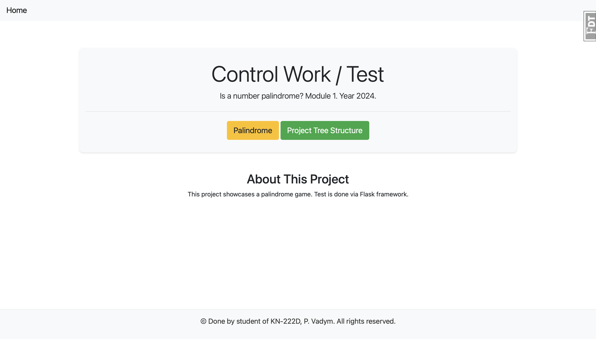

# Test for Python Frameworks
For Semester No. 3

## Website Cover
Here is the cover of the website with 2 buttons:

- **Palindrome**: main project;
- **Project Tree Structure**: structure of the whole project.

## Menu of the Game
Here we can enter an integer to find out whether it is a palindrome. It accepts **only integer values**!

## Let's Enter a Valid Number
Here we enter a valid number and get the appropriate photo and flash message!

## Let's Enter a NOT Valid Number
Here we enter a NOT valid number and get the appropriate photo and flash message!

---

Thank you for checking out this project!

